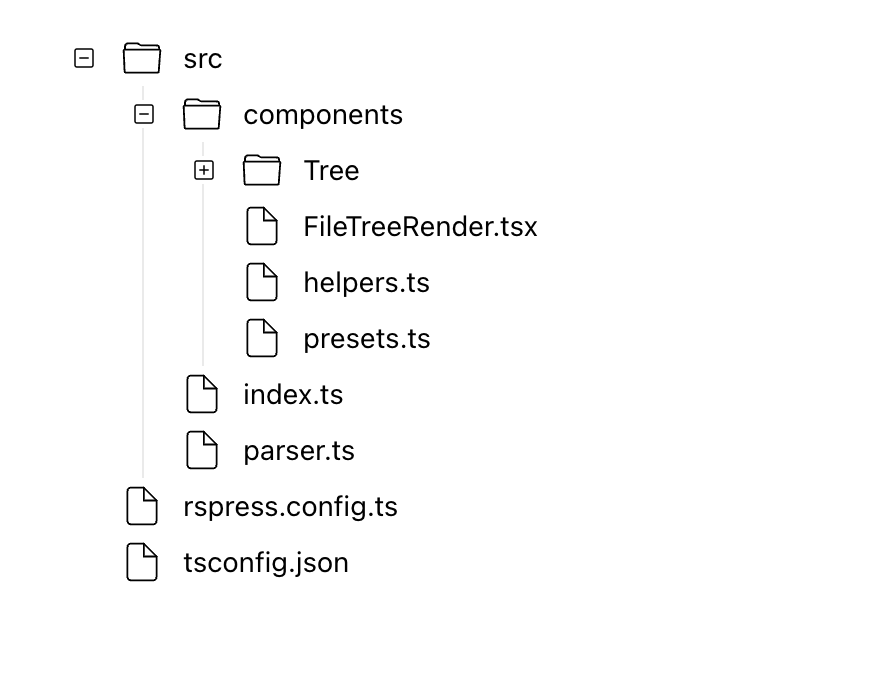

# rspress-plugin-file-tree 

[简体中文](./README.zh-CN.md)

用于展示文件树的 Rspress 插件。

使用 `tree` 语言的代码块来书写树形结构：

````markdown
```tree
.
├── rspress.config.ts
├── src
│   ├── components
│   │   ├── FileTreeRender.tsx
│   │   ├── Tree
│   │   │   ├── Expand.tsx
│   │   │   ├── FileIcon.tsx
│   │   │   ├── Tree.tsx
│   │   │   ├── TreeContext.tsx
│   │   │   ├── TreeFile.tsx
│   │   │   ├── TreeFolder.tsx
│   │   │   ├── TreeFolderIcon.tsx
│   │   │   ├── TreeIndents.tsx
│   │   │   ├── TreeStatusIcon.tsx
│   │   │   ├── index.less
│   │   │   └── index.tsx
│   │   ├── helpers.ts
│   │   └── presets.ts
│   ├── index.ts
│   └── parser.ts
└── tsconfig.json
```
````

它将被渲染为：

<div align="center">
  
</div>

> [!NOTE]
>
> **最终渲染的组件 fork 自 [witt](https://github.com/unix) 的 [Geist UI](https://geist-ui.dev/), 感谢他的贡献。**

## 使用

```bash
npm i rspress-plugin-file-tree
pnpm add rspress-plugin-file-tree
```

```ts
import * as path from 'path';
import { defineConfig } from 'rspress/config';
import fileTree from 'rspress-plugin-file-tree';

export default defineConfig({
  root: path.join(__dirname, 'docs'),
  plugins: [fileTree()],
});
```

## 配置

## initialExpandDepth

配置文件树的初始展开深度。

- Type: `number`
- Default: `0`

```ts
import * as path from 'path';
import { defineConfig } from 'rspress/config';
import fileTree from 'rspress-plugin-file-tree';

export default defineConfig({
  root: path.join(__dirname, 'docs'),
  plugins: [
    fileTree({
      initialExpandDepth: Infinity,
    }),
  ],
});
```
