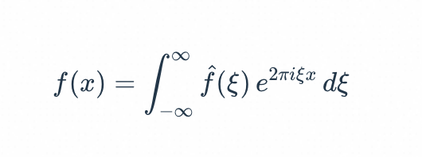

# rspress-plugin-katex 

Rspress plugin to add support for rendering math equations using [KaTeX](https://katex.org/).

````markdown
```math
% \f is defined as #1f(#2) using the macro
\f\relax{x} = \int_{-\infty}^\infty
    \f\hat\xi\,e^{2 \pi i \xi x}
    \,d\xi
```
````

```ts
import * as path from 'path';
import { defineConfig } from 'rspress/config';
import mermaid from './src';

export default defineConfig({
  root: path.join(__dirname, 'docs'),
  plugins: [
    mermaid({
      macros: {
        '\\f': '#1f(#2)',
      },
    }),
  ],
});
```

<div align="center">
  
</div>

## Usage

```bash
npm i rspress-plugin-katex
pnpm add rspress-plugin-katex
```

```ts
import * as path from 'path';
import { defineConfig } from 'rspress/config';
import katex from 'rspress-plugin-katex';

export default defineConfig({
  root: path.join(__dirname, 'docs'),
  plugins: [katex()],
});
```

## Configure

See [KaTeX documentation](https://katex.org/docs/options.html) for more details.