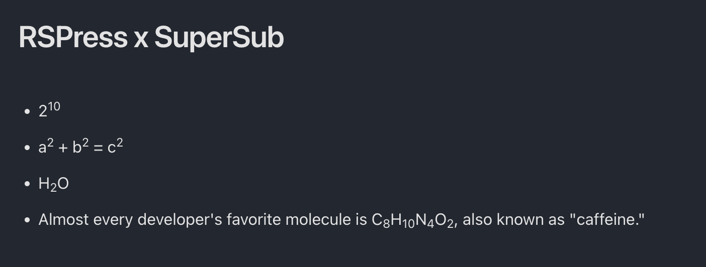

# rspress-plugin-supersub 

为 Rspress 支持上标(`<super></super>`)与下标(`<sub></sub>`)语法。

> [!NOTE]
> 由于规范的下标语法 `~` 与删除语法(`<del></del>`)冲突，相比之下后者更常用，因此此插件使用 `_` 作为下标语法，你也可以通过配置修改上标与下标的语法。

```markdown
- 2^10^
- a^2^ + b^2^ = c^2^
- H_2_O
- Almost every developer's favorite molecule is C*8_H_10_N_4_O_2*, also known as "caffeine."
```

<div align="center">
  
</div>

## 使用

```bash
npm i rspress-plugin-supersub
pnpm add rspress-plugin-supersub
```

```ts
import * as path from 'path';
import { defineConfig } from 'rspress/config';
import supersub from 'rspress-plugin-supersub';

export default defineConfig({
  root: path.join(__dirname, 'docs'),
  plugins: [supersub()],
});
```

## 配置

### superSyntax

配置上标的语法。

- Type: `string`
- Default: `^` (matching `^sup^`)

### subSyntax

配置下标的语法。

- Type: `string`
- Default: `_` (matching `_sub_`)
